<p align="center">
  
</p>

<p align="center"><b>OtoDock — Collaborative Agents</b></p>

<h1 align="center">The agentic company OS.</h1>

<p align="center">
  The brains of your company, built on Claude Code &amp; Codex, working on your Anthropic and OpenAI subscriptions.
</p>

<p align="center">
  <a href="LICENSE"></a>
  
  <a href="https://github.com/OtoDock/oto-dock/actions/workflows/ci.yml"></a>
  <a href="https://docs.otodock.io"></a>
  <a href="https://otodock.io"></a>
</p>

<p align="center">
  <a href="https://docs.otodock.io">Docs</a> ·
  <a href="#quick-start">Install</a> ·
  <a href="https://otodock.io/features">Features</a> ·
  <a href="https://github.com/OtoDock/oto-dock/discussions">Discussions</a>
</p>

<br/>

<p align="center">
  <b>Self-hosted · Multi-tenant by design · Fair source</b><br/>
  <sub>Runs on&nbsp; Claude Code · Codex · your API keys · local models</sub>
</p>

<br/>

<p align="center">
  
</p>

<p align="center"><em>Dashboard highlights. <a href="#the-two-minute-video">The two-minute video</a> tells the whole story.</em></p>

<p align="center">If OtoDock is useful to you, a star on this repository helps other people find it.</p>

---

## Why OtoDock

OtoDock acts as the brain of your company. You create powerful agents that
connect to the tools your company runs on, work in departments, delegate to
each other, and keep working on their own when no one is watching. It is
multi-tenant by design. Many people work with the same agents, and there
are four modes that decide how an agent is shared and where its work lands.
You work with your agents on your self-hosted dashboard, or you can even
give them a phone line and talk to them. All of it runs on your own
Anthropic and OpenAI subscriptions, and on local models.

## Build your own AI agents

Every agent gets a name and a job, like a Personal Assistant, a System Admin
or a Marketing Manager, and runs on your server. An agent is made of six
parts, and you can edit every one of them.

- **Persona.** Plain-language instructions tell the agent who it is and how
  it works.
- **Memory.** The agent keeps its own notes across chats.
- **Workspace.** The folder where the everyday work lands. It is private for
  each person, shared by the whole team, or both, depending on the agent's
  mode.
- **Knowledge.** Reference documents are always on hand.
- **Skills.** The agent learns techniques it can apply to its work.
- **Tools.** The agent uses only what it is allowed to use.

<p align="center">
  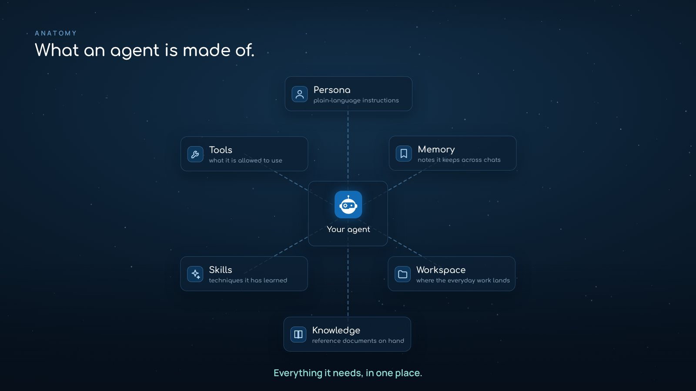
</p>

## Four ways to share one agent

Every agent has a mode that decides how people share it.

| Mode | What it means |
|---|---|
| **Personal only** | A private workspace for each person. |
| **Personal + shared** | A private workspace for each person as the default, and a shared one for the team. |
| **Shared + personal** | A shared team workspace as the default for everyday work, plus a private one per person. |
| **Shared only** | Everyone shares one history and one workspace. |

## Everyone gets the right seat

Admins add each person to the agents they need.

| Three platform roles | Three roles on every agent |
|---|---|
| An **Admin** runs the platform. | A **Manager** has full control of the agent. |
| A **Creator** creates agents. | An **Editor** edits the shared files. |
| A **Member** uses the agents they are given. | A **Viewer** chats and reads the shared files. |

## Claude Code or Codex. Your subscription.

Claude Code runs on your Anthropic subscription, and Codex runs on your
ChatGPT subscription. Every user connects their own subscription. Local
models on your own hardware work as well. You pick the engine per agent,
and you can switch it per chat.

<p align="center">
  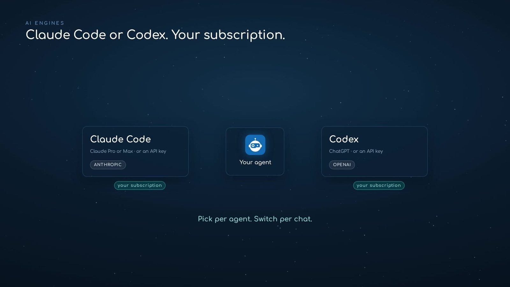
</p>

## They work while you are away

Agents run on any schedule, when a webhook event fires, or once at a time
you choose. They work in your workspace, where their reports, files and
updates land, and they notify you when something needs you. Notifications
come in four severities, from a quiet chime to a persistent danger alarm.
Every run is a full chat you can open, read and continue, so no one has to
be watching.

<p align="center">
  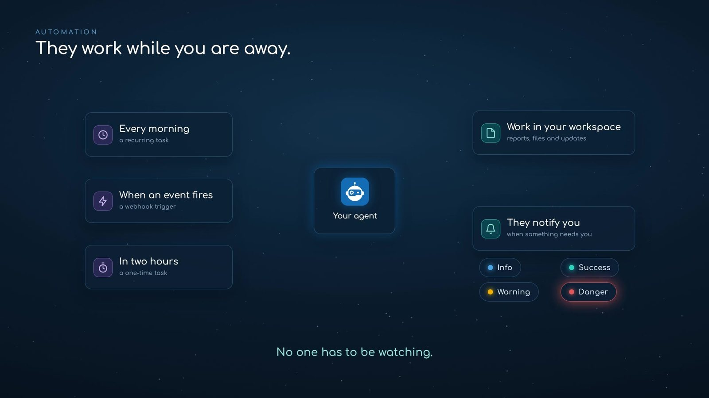
</p>

## Give an agent a phone number

Agents answer and place phone calls. Bring your own Twilio account, or
connect the Asterisk or FreePBX server you already run.

<p align="center">
  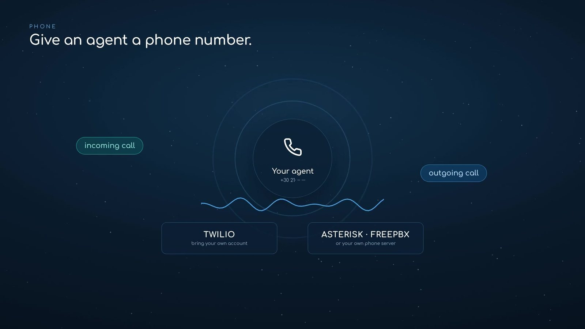
</p>

## Runs on your server. Works on your machines.

By default, all your agents run on your server, in an isolated sandbox, with
one dashboard controlling all of them. You can also pair a laptop, a
workstation or a PC running macOS, Linux or Windows with a one-line install.
The machine keeps a single outbound connection to your server, so it needs
no open ports, and its files stay in sync. The same agent then runs on that
machine with full access to it, and you work with it from the same
dashboard, anywhere. If the machine goes offline, your server takes over.

<p align="center">
  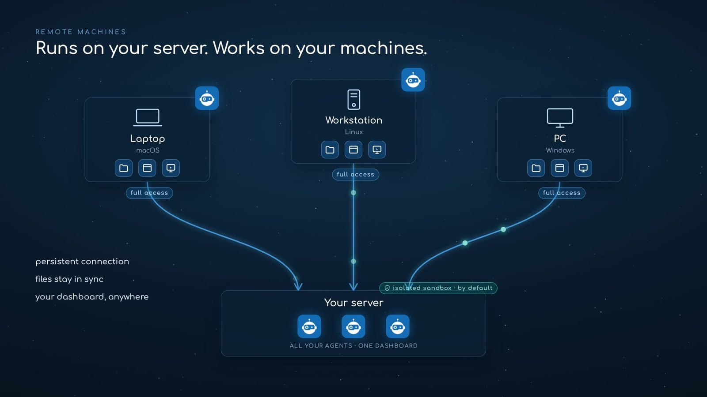
</p>

<h3 align="center">Your own cloud of agents.</h3>

## The two-minute video

https://github.com/user-attachments/assets/2d829ee3-2d4c-4001-8b40-73c2eb90c661

<p align="center"><em>This entire video was directed, captured and edited by an OtoDock agent.
<a href="https://otodock.io">Watch it in full quality on otodock.io</a>.</em></p>

## The company, running

<table>
  <tr>
    <td width="50%">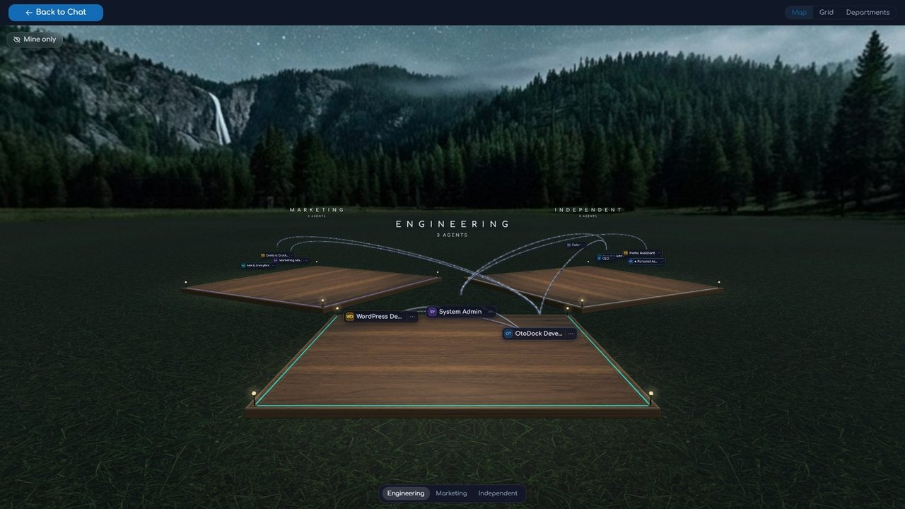</td>
    <td width="50%">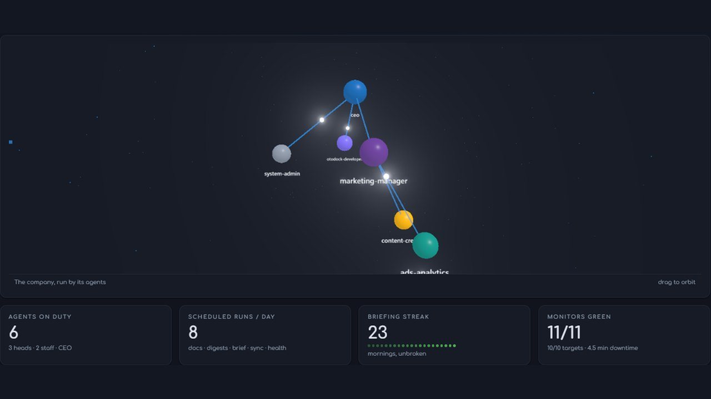</td>
  </tr>
  <tr>
    <td><b>Departments.</b> Organize your agents into departments, decide who can delegate to whom, or put them in a meeting together.</td>
    <td><b>Live dashboards.</b> Every agent gets live dashboards, so you can manage them effortlessly.</td>
  </tr>
  <tr>
    <td>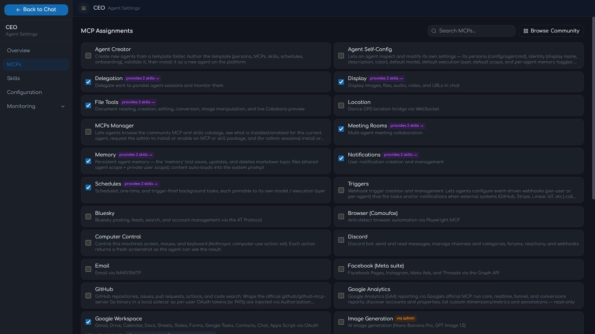</td>
    <td>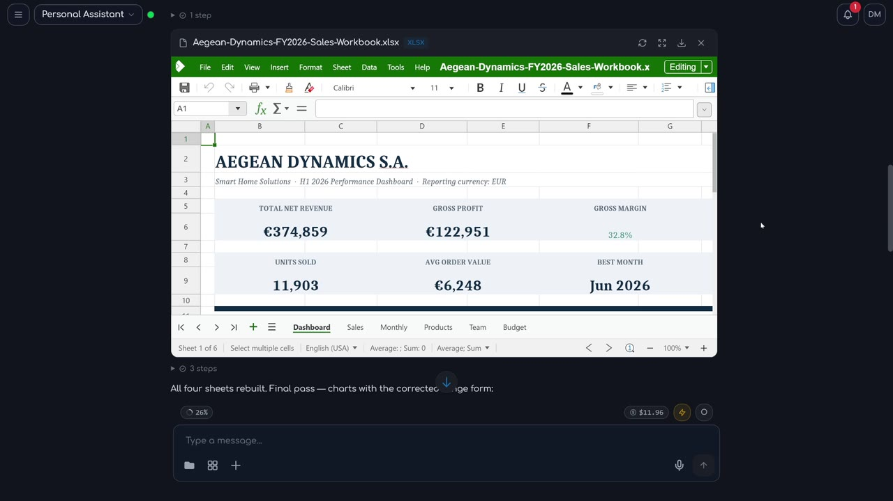</td>
  </tr>
  <tr>
    <td><b>Endless tools.</b> Your agents are digital employees. They connect to endless tools, from your calendar to your smart home.</td>
    <td><b>Documents.</b> They edit Excel, Word and PowerPoint files right in the chat.</td>
  </tr>
  <tr>
    <td>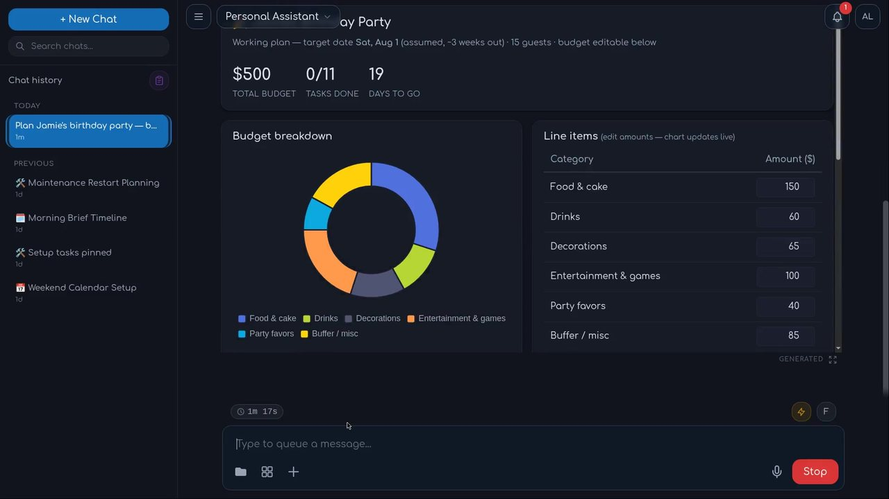</td>
    <td>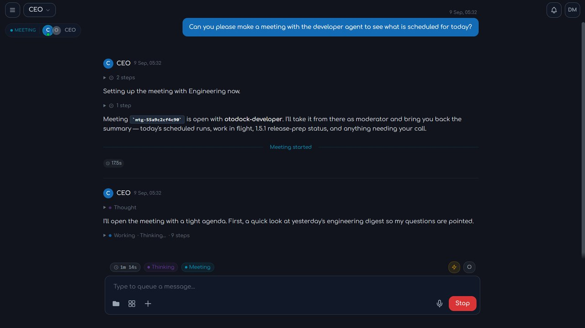</td>
  </tr>
  <tr>
    <td><b>Artifacts.</b> Agents answer with live, interactive UI, rendered right in the chat.</td>
    <td><b>Meetings.</b> Specialist agents discuss a topic together and converge on an answer, live in the dashboard.</td>
  </tr>
  <tr>
    <td>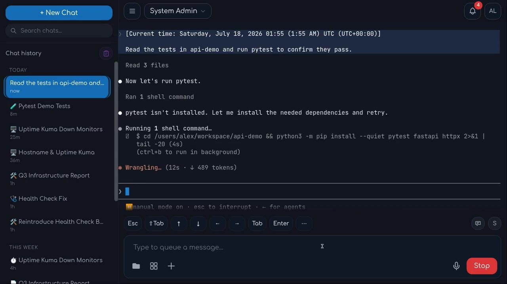</td>
    <td>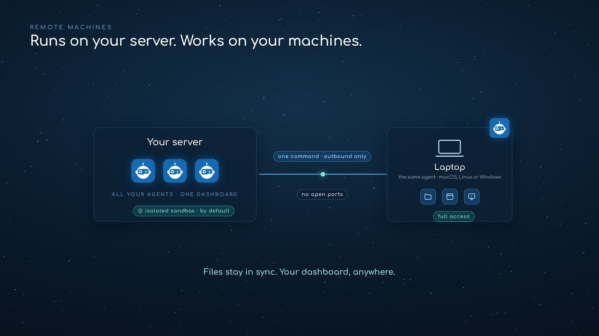</td>
  </tr>
  <tr>
    <td><b>Terminal.</b> The Claude Code or Codex terminal opens in the dashboard, with the agent's tools already loaded.</td>
    <td><b>Remote machines.</b> The same agent, with all its tools and its synced workspace, runs on any machine you pair with one command, and it can use everything on that machine.</td>
  </tr>
</table>

## Locked down by default

Agents are powerful, so OtoDock assumes they can't be trusted. Every
server-side agent runs inside a kernel sandbox with always-on network
isolation, and you grant access one service at a time.

- **A kernel sandbox around every agent.** Each session runs in its own
  mount and process namespace. Folders are mounted automatically from each
  user's role per agent.
- **Network isolation.** Private ranges, your LAN, and cloud metadata
  endpoints are unreachable by design. MCP tools that need a local service
  can be granted scoped access by the admin, per agent.
- **Secure credentials.** Credentials are encrypted at rest and injected
  only per session. Agents can use them, but never see them.
- **Ready for teams.** SSO sign-in, two-factor auth, and per-user cost
  budgets come standard, from the first install.

[Read the security model →](https://docs.otodock.io/security/overview)

## Everything included

One platform, the whole toolkit.

- **Memory that persists.** Agents keep transparent, editable memory files,
  per user and per agent.
- **Documents and files.** Agents create and edit Word, Excel, PowerPoint
  and PDF files, and every file opens in a live editor inside the chat.
- **Images.** Agents generate and edit images in the chat, and a
  professional-grade pipeline handles photo editing.
- **Video and audio.** Agents generate footage and transitions, cut
  timelines, add captions, voice-overs and music, transcribe audio and video
  into text and subtitles, and produce speech and music of their own.
- **Web browsing.** The browser tool from the community catalog lets agents
  research the live web.
- **Built-in tools.** Schedules, triggers, notifications, meetings,
  delegation, phone calls, file transfer between agents, live charts and
  mini-apps, SSH hosts, and browser and computer control on paired machines
  all ship with the platform.
- **Community catalog.** Ready-made agents, tools and skills install in one
  click, with GitHub, Notion, Home Assistant, Nextcloud, Prometheus, UniFi
  and Uptime Kuma among them, and more landing regularly.
- **Extensible by design.** Any MCP tool server installs from a manifest,
  and tools are assigned per agent.
- **Usage and budgets.** Costs are tracked per user and per agent, with
  weekly or monthly limits.
- **Team-ready security.** SSO and OIDC, two-factor auth, per-agent roles,
  encrypted credentials and scoped API keys come from day one.

See all features at [otodock.io/features](https://otodock.io/features).

## Quick start

**Frostyard fork:** Copilot support is under development, with an opt-in
[local chat preview](docs/plans/copilot-chat-preview-contract.md) for personal
GitHub accounts, with agent chat navigation, saved conversations, and explicit
clean resume. Full engine parity remains incomplete. Use the
[Frostyard source-build instructions](docs/development/frostyard-releases.md).
The installer in this fork is disabled pending release qualification. The quick
start below installs **upstream OtoDock**, without Frostyard changes.

A Linux server with Docker is all you need (4 GB RAM minimum, see the
[sizing guide](https://docs.otodock.io/getting-started/installation#how-much-ram)).
Create a folder for the install, then run the script in it:

```bash
mkdir otodock && cd otodock
curl -fsSLO https://raw.githubusercontent.com/OtoDock/oto-dock/main/scripts/install.sh
bash install.sh
```

The installer checks Docker, writes a `.env` with a generated database
password, handles the Ubuntu 24.04+ host step automatically when the host
needs it, downloads the release-pinned `docker-compose.yml` plus the
phone-service overlay, and starts the stack. Everything lands in the folder
you run it from. The script performs fresh installs only, and stops rather
than touch an existing install.

If your users browse to the server by name or IP, set `DASHBOARD_PUBLIC_URL`
in the generated `.env`. Behind a reverse proxy, also set `TRUSTED_PROXY` to
your proxy's IP
([reverse proxy & HTTPS](https://docs.otodock.io/getting-started/installation#put-it-behind-https)).
Every optional knob is documented in the
[Configuration reference](https://docs.otodock.io/administration/configuration),
and the [installation guide](https://docs.otodock.io/getting-started/installation)
also covers building from source, bare-metal development, and running
behind a reverse proxy with HTTPS.

## The first five minutes

Open **http://localhost:8400** and the setup wizard greets you. Create the
owner account, and OtoDock installs the Personal Assistant for you, with the
tools it needs. Connect your Claude or ChatGPT subscription under Setup,
AI Engines, and the banner that reminds you goes away. Open the Personal
Assistant from the Agents page and send it your first message. Its reply
streams in live, with every tool call and every file it creates
([First run](https://docs.otodock.io/getting-started/first-run)). From there
you add agents from the community catalog or build your own, and you add
the people who will work with them.

## How it fits together

```
 dashboard/   React dashboard — chat, agents, tasks, files, admin
 proxy/       Platform core (FastAPI) — sessions, security, scheduling,
              the agent sandbox, and the WebSocket hub the dashboard talks to
 mcps/        MCP tool servers: OtoDock's custom set (files, memory, tasks,
              meetings, notifications, …) + community mirrors
 audio/       Speech package — STT / TTS / voice activity, provider-agnostic
 phone/       Telephony daemon — live calls over Twilio or FreePBX/Asterisk
 satellite/   Remote-machine agent — pairs your own hardware to the platform
 scripts/     Install, compose, backup/restore, and maintainer tooling
```

Agents run as Claude Code / Codex processes inside per-session kernel
sandboxes, talk to their tools over MCP, and stream every step back to the
dashboard. PostgreSQL holds the platform state.

## Community

- **Docs:** [docs.otodock.io](https://docs.otodock.io)
- **Website:** [otodock.io](https://otodock.io)
- **Community agents:** [OtoDock/community-agents](https://github.com/OtoDock/community-agents)
- **Community MCPs:** [OtoDock/community-mcps](https://github.com/OtoDock/community-mcps)
- **Community skills:** [OtoDock/community-skills](https://github.com/OtoDock/community-skills)
<!-- COMMUNITY: Discord invite lands here at launch (Phase 8) -->

Contributions are welcome: see [CONTRIBUTING.md](CONTRIBUTING.md). Security
reports: [SECURITY.md](SECURITY.md).

## License

OtoDock is **fair source**: licensed under the
[Functional Source License, v1.1, with Apache 2.0 future grant](LICENSE)
(FSL-1.1-Apache-2.0). You can use, run, modify, and redistribute it for
anything except competing with OtoDock commercially — and each version
automatically becomes plain **Apache 2.0 two years** after its release.

Self-hosting is free for up to 5 users. Growing teams
[license by seats](https://otodock.io/pricing). Same software, signed key,
no feature gates on your data or your agents.

## A note from the author

OtoDock started with Claude Code. I wanted to use it beyond the terminal
and connect it to my services. So I built the platform around that idea.
It has since become the place where my own agents work: large parts of
OtoDock were built, tested, and shipped by agents running on OtoDock.

It's fair source so you can run it the same way for your company, and you
can share your builds in the
[discussions](https://github.com/OtoDock/oto-dock/discussions).

— Dimitris Mourtzis
