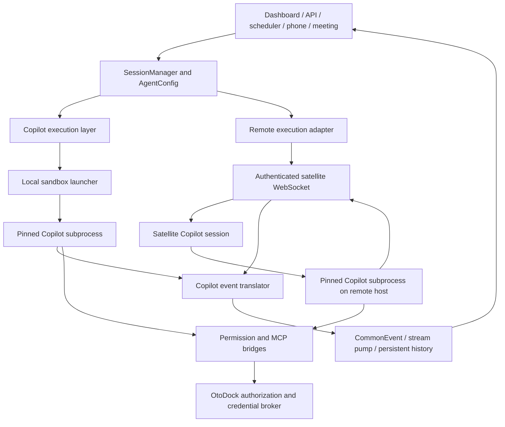

# GitHub Copilot execution engine: full parity plan

Status: implementation started. C0 is complete; C1 is in progress. The engine is
not registered or available to users yet.

Progress: [C0 baseline](copilot-ci-baseline.md),
[C1 compatibility inventory](copilot-compatibility.md),
[C1 SDK results](copilot-spike-results.md),
[C1 sandbox results](copilot-sandbox-results.md),
[owned session supervisor results](copilot-supervisor-results.md), and
[account and credential lease foundation](copilot-account-leases.md), and
[account connection preview](copilot-connect-results.md), and
[owned permission and question bridge](copilot-permission-results.md).

Tracking issue: [Copilot: full Claude Code and Codex parity](https://github.com/frostyard/oto-dock/issues/1).

Owner: Frostyard. Planning baseline: OtoDock 1.6.0, upstream commit
`39af5ff79ed209e270a7fce4bd4141496f88c7f9`. Source and vendor documentation
reviewed 2026-09-09. Reconcile this inventory when rebasing onto newer upstream
releases. This document describes proposed behavior, not shipped capabilities.

## Outcome and completion rule

Add `copilot-cli` as a first-class execution engine. A user must be able to choose
GitHub Copilot anywhere OtoDock offers Claude Code or Codex: personal and shared
agents, dashboard chat, terminal sessions, scheduled and delegated work, remote
machines, meetings, and phone sessions. Mixed-engine organizations must work.

The release target is the **union of the existing Claude and Codex product
workflows**, with equivalent observable behavior and enforcement. It does not
require identical model names, native CLI commands, or reasoning output. A model
or account may lack a capability, but hiding a required workflow does not satisfy
parity. Every matrix row needs evidence or an explicit unresolved blocker; only
an explicit scope decision can remove a requirement. Intermediate milestones
remain experimental and must not be announced as full parity.

Reference acceptance scenario: a CTO receives a vision to migrate several GUI
repositories to Python, GTK4, and libadwaita; delegates repository assessments to
Copilot workers; sends plans to QA agents using another engine; and synthesizes
the dependencies, sequencing, and per-repository proposals. A restart or temporary
worker disconnect must preserve task identity and avoid duplicate submissions.
Use disposable repositories for the acceptance run.

## What the repository actually provides

| Existing surface | Evidence and implication |
| --- | --- |
| Backend contract and registration | [ExecutionLayer](../../proxy/core/execution_layer.py) and [session manager](../../proxy/core/session/session_manager.py) supply lifecycle methods, capabilities, and `register_layer()`. Implement the full contract, including optional controls needed for parity. |
| Closest integration template | [Codex layer](../../proxy/core/layers/codex/layer.py), [session](../../proxy/core/layers/codex/session.py), and [translator](../../proxy/core/layers/codex/translator.py) demonstrate persistent RPC sessions and event normalization. |
| Shared presentation contract | [CommonEvent](../../proxy/core/events/common_events.py) includes permissions, questions, plans, todos, background commands, subagents, workflows, goals, compaction, and usage; text streaming is only one part. |
| Engine selection is partly hardcoded | [Admin API](../../proxy/api/admin/execution_layers.py), [config builder](../../proxy/core/config/config_builder.py), [subscription pool](../../proxy/services/engines/subscription_pool.py), and [dashboard engine settings](../../dashboard/src/pages/UserSettings.aiEngines.tsx) contain engine-specific decisions. A search for existing engine IDs matched 147 files, including tests; this is an inventory, not an estimate of files to edit. |
| Remote execution has its own lifecycle | [Remote adapter](../../proxy/core/remote/remote_execution.py), [satellite session manager](../../satellite/sessions/session_manager.py), and [Codex remote session](../../satellite/sessions/codex_session.py) need a Copilot path. Read implementation first: satellite README still describes an obsolete Codex process-per-turn model. |
| Recovery differs between engines | [Run recovery](../../proxy/services/scheduler/run_recovery.py) currently adopts live remote Claude sessions across proxy restarts. Codex next-turn resume is not equivalent to adopting an in-flight run. Copilot must cover both workflows. |
| Native terminal is a separate path | [Interactive sessions](../../proxy/core/session/interactive_session.py), [execution mode](../../proxy/core/execution_mode.py), and [satellite PTY implementation](../../satellite/terminal/codex_pty_session.py) bypass parts of the headless stream. Both paths need enforcement and persistence tests. |
| Runtime provisioning is coordinated | [Version pins](../../VERSIONS.md), [baseline installer](../../scripts/install-baseline-tools.sh), and [satellite reconciliation](../../satellite/host/cli_versions.py) install and verify engine versions. The Windows installer still accepts Python 3.10, below the documented Copilot Python SDK minimum. |
| Fork CI needs enablement | Both jobs in [CI](../../.github/workflows/ci.yml) are restricted to `OtoDock/oto-dock`. Change the repository guard deliberately for Frostyard and add satellite test coverage; skipped jobs are not validation. |

## Proposed architecture

Use the official Python Copilot SDK to drive a pinned subprocess runtime over
stdio. This is the preferred design, subject to the first compatibility spike.
The SDK documents streaming, history/resume, MCP, permission callbacks, custom
tools, and subprocess transports. It requires Python 3.11+. Published wheels
identify a pinned runtime which can be provisioned before startup.
[SDK reference](https://github.com/github/copilot-sdk/blob/main/python/README.md)

Proposed modules, following existing conventions:

- `proxy/core/layers/copilot/{layer,session,client,translator,permissions}.py`:
  thin SDK boundary, lifecycle, event mapping, and policy translation.
- `satellite/sessions/copilot_session.py` and
  `satellite/terminal/copilot_pty_session.py`: remote headless and terminal paths.
- Copilot authentication routes plus engine descriptors for credentials,
  configuration format, runtime requirements, and UI capabilities. Extend shared
  abstractions only where a concrete third-engine branch justifies it.

The proxy stays responsible for task orchestration, authorization, attribution,
and persisted user-visible events. The satellite supervises its processes and
relays requests/events. Follow the existing vendoring/hash workflow for shared
code; do not create divergent event translators on proxy and satellite.

The local runtime must start through the existing bubblewrap/pasta launcher.
Avoid SDK auto-spawn paths that launch outside that boundary and avoid in-process
FFI for the engine runtime. On satellites, preserve the existing host policy:
agents run as the host user, without the local Linux sandbox. Document that
difference accurately. SDK-hosted custom tool callbacks must call authorized
OtoDock services or sandboxed tools, never execute arbitrary shell/file operations
with proxy privileges.

Use a session-specific `COPILOT_HOME` and explicit identity. The CLI also offers
ACP and native terminal operation. Assess ACP as an alternative during the spike
if SDK launch or terminal integration cannot meet the contract; do not maintain
two headless adapters without a demonstrated need. Disable built-in GitHub MCP
and ambient tool/plugin discovery unless explicitly admitted by OtoDock policy.
[CLI reference](https://docs.github.com/en/copilot/reference/copilot-cli-reference/cli-command-reference)

## Parity acceptance matrix

All rows start **unverified**. Phase IDs below identify the implementation work.
Test local and remote headless paths and terminal paths wherever the workflow is
offered by either existing engine. Distinguish a product workflow from an
engine-native implementation detail when establishing equivalence.

| ID | Required outcome | Minimum acceptance evidence | Phase |
| --- | --- | --- | --- |
| P01 | Engine and model selection | Admin enable/disable; personal settings; agent/chat/task overrides; persisted defaults; capability and entitlement-aware model/effort choices. | C2, C3, C5 |
| P02 | Correct credentials and payer | Connect, validate, disconnect, expire/refresh, revoke, and rebind accounts; concurrent users and shared agents never borrow another identity implicitly. Pool selection and failover preserve acquisition scope. | C2 |
| P03 | Provider configuration | Copilot subscriptions and supported BYOK/local endpoints fit existing account/model management workflows. Validate endpoint reachability inside the sandbox and through remote targeting. Missing vendor support remains a tracked parity blocker. | C1, C2, C3 |
| P04 | Chat and tools | Ordered text and available reasoning summaries, tool input/result pairing, errors, artifacts, attachments/images where supported, and transcript persistence without duplicate terminal events. | C3, C5 |
| P05 | Full turn lifecycle | Start/warm, queue, follow-up, steer or equivalent stop-and-send, graceful abort, hard cleanup, locks, idle/death detection, and bounded timeout behavior; partial turns survive correctly. | C3 |
| P06 | Permissions and questions | Default, accept-edits, plan, and unattended/dontAsk behavior matches OtoDock policy; denied shell/file/MCP actions do not execute; questions resolve once; pending prompts survive UI reconnect and expire safely. | C4 |
| P07 | Plans, todos, and goals | Enter/exit plan mode, implementation handoff, todo updates, durable goal progress, pause/resume/complete, budget/usage limits, and manual/automatic compaction workflows. Use native support or a tested platform equivalent. | C4, C5 |
| P08 | MCP and credentials | Stdio and HTTP MCPs, installation/warmup, per-server broker secrets, elicitation, token renewal, path translation, tunnel operation, and teardown. No unregistered built-in tools bypass policy. | C4, C6 |
| P09 | Agent context | System instructions, repository instructions, skills, knowledge/memory, department/role context, scoped workspaces, and explicit instruction precedence reach the selected session. Engine switching preserves history using existing handoff semantics. | C3, C4, C5 |
| P10 | Delegation and background work | Cross-engine delegation, native subagent visibility, background shell completion, workflow progress, parent settlement, cancellation propagation, and results returned exactly once to the parent. | C4, C8 |
| P11 | Automation and non-chat clients | Scheduled tasks, triggers/webhooks, internal calls, streaming API, meetings, and phone sessions honor identity, target, cancellation, and unattended permissions. No approval waits where nobody can answer. | C8 |
| P12 | Remote workers | Admin/user targeting, target affinity and visible fallback, outbound WS transport, file sync and credential exclusions, capability/version reporting, remote MCP, and disconnect handling. | C6 |
| P13 | Native terminal | Dashboard PTY and local `otodock` CLI; first prompt, resize, colors, Unicode, reconnect, permissions, file writeback, safe resume, history capture, and transition to/from headless mode. | C7 |
| P14 | Resume and recovery | Cold history resume plus adoption of a still-running remote turn after proxy restart; replay deduplication, stable run IDs, retained partial output, bounded failure on lost workers, and no automatic replay of uncertain side effects. | C3, C6, C8 |
| P15 | Usage and operations | Correct account/user/agent/run attribution; tokens/context/credits reported only when known; no fabricated dollar costs; quota/auth/rate-limit errors and bounded retries visible to operators. | C2, C5, C9 |
| P16 | Install, upgrade, and rollback | Reproducible Docker and bare-metal install; supported Linux/macOS/Windows satellite combinations; SDK/runtime pins and drift reporting; migrations; old-satellite negotiation; clean disable and rollback. | C0, C1, C6, C9 |

## Authentication and authorization design

OtoDock login, Copilot inference authorization, and repository/MCP authorization
are separate identities. An OtoDock GitHub login or an existing repository token
must not silently become the inference payer.

For personal accounts, evaluate the documented OAuth/GitHub App user flow and
fine-grained PAT path. GitHub documents explicit user tokens and disabling
stored-login fallback; classic PATs are not supported. Store credentials using
the existing encrypted credential facilities, expose only masked status, and
bind account selection to each session's acquisition scope.
[User authentication](https://docs.github.com/en/copilot/how-tos/copilot-sdk/auth/authenticate)

For organization-funded automation, GitHub documents installation tokens with
Copilot Requests permission, organization enablement, and currently an
all-repositories installation requirement. Installation tokens use the runtime
environment rather than the SDK user-token option; they expire after one hour
and refresh requires a runtime restart. Verify eligibility before selecting this
as Frostyard's operational default. No GitHub App installation or billing policy
change is part of this planning work.
[Service authentication](https://docs.github.com/en/copilot/how-tos/copilot-sdk/auth/server-to-server-tokens)

Design credential refresh as a state transition: stop accepting a new turn,
settle or safely interrupt the current turn, refresh the selected identity,
restart and resume, then reopen the queue. Test long-running background tools and
subagents at this boundary. An expired or revoked account must not fall back to
ambient `gh` credentials or a different user's subscription.

Use separate per-session credential/config directories even for sessions working
in the same shared agent workspace. Audit the existing shared-only credential
overwrite risk before reusing its materialization path. Persist non-secret payer
and session identifiers, redact diagnostic fixtures, exclude credentials from
normal workspace sync, and explicitly scope any remote credential transfer.

Permissions must use the existing authority in
[hooks](../../proxy/api/hooks/hooks.py). Native allow-all flags or SDK
approve-all callbacks cannot replace it. Plan mode must prevent writes and other
mutating actions, including through shell, MCP, native subagents, and terminal
commands. Missing policy coverage is a release blocker. Test built-in Copilot
GitHub tools, repository hooks, plugins, URLs, and instructions as independent
ways an operation could enter the runtime.

## Work breakdown and dependencies

Each phase is a focused issue/PR-sized workstream; larger phases should split by
local/remote implementation while sharing acceptance tests. Estimates are
engineering days, include relevant tests, and assume an engineer familiar with
the code. They are not elapsed-time promises.

| Phase | Deliverable and exit gate | Depends on | Estimate |
| --- | --- | --- | --- |
| C0 | Establish Frostyard CI: amend fork guards, verify existing gates, add satellite suite, audit release image names/update feeds so fork builds do not publish or install upstream artifacts accidentally. Exit: executed baseline results with pre-existing failures recorded. | — | 1–2 days |
| C1 | Compatibility spike and transport decision: select exact SDK/runtime versions; verify sandbox launch, auth, tool denial, MCP, resume, PTY/history interoperability, token refresh, events, and OS/runtime support. Publish sanitized recordings and a method/event/control map against P01–P16. | C0 | 3–5 days |
| C2 | Accounts and provisioning: auth flows, encrypted storage, scoped pool leases, refresh/revocation, shared-account isolation, model discovery, BYOK/provider routes, and attributed usage identity. Exit: concurrent-account and expiry tests pass. | C1 | 4–6 days |
| C3 | Local execution layer: register engine, config generation, sandbox spawn, session persistence, CommonEvent translation, turn controls, attachments, and resume. Exit: contract tests and sandboxed live chat pass. | C1, C2 | 4–6 days |
| C4 | Policy and agent tools: permission/question bridge, plan mode, skills/context, brokered MCP, goals/todos, compaction, background commands/subagents, and delegation hooks. Exit: allow/deny tests cover all execution routes. | C3 | 4–7 days |
| C5 | Complete dashboard/API behavior: connect/settings flows, selectors, capability controls, plans/goals/artifacts, history/handoffs, usage and errors; audit all spawn entry points. Exit: UI tests exercise every applicable matrix row. | C2, C3, C4 | 3–5 days |
| C6 | Remote execution: satellite runtime install/probe, versioned commands, credential transfer, file/path handling, RPC callbacks, event replay, and live-run adoption. Exit: Linux/macOS/Windows headless matrix plus reconnect/restart faults pass. | C3, C4 | 4–7 days |
| C7 | Terminal parity: local and remote native PTY, `otodock` CLI integration, policy enforcement, transcript capture, cold/warm resume, and terminal/headless handoff. Exit: PTY suite plus real terminal smoke tests on supported OSes. | C4, C5, C6 | 3–6 days |
| C8 | Organization workflows and recovery: scheduled/delegated/triggered/phone/meeting runs, mixed-engine tasks, background settlement, restart adoption, and safe treatment of uncertain side effects. Exit: CTO/repository/QA scenario plus injected failures. | C4, C5, C6 | 3–5 days |
| C9 | Release qualification: full regression matrix, resource soak, credential review, documented setup/troubleshooting, migration/rollback rehearsal, and reproducible fork artifacts. Exit: every parity row has linked passing evidence and no unresolved parity blockers. | C0–C8 | 3–5 days |

Total provisional effort: **32–54 engineering days**, roughly **6–11 working
weeks** for one engineer. Re-estimate after C1. This is broader than the earlier
rough 3–6 week estimate: the explicit union includes goals, provider workflows,
all satellite platforms, native terminals, phone/meeting paths, and live recovery.
Vendor gaps requiring platform equivalents may exceed the range. Some work can
proceed independently once the runtime and event contracts are established.

## First spike: questions that must become evidence

1. Can the exact pinned SDK/runtime launch under the local sandbox with no
   runtime downloads at session start, including MCP subprocesses and teardown?
   Can satellite Python 3.10 hosts retain existing engines while provisioning a
   separate supported runtime, or does Copilot require an explicit host upgrade?
2. Do native permissions and SDK callbacks expose enough detail to apply every
   OtoDock rule, including rewritten tool arguments, questions, URLs, and
   unattended denials? Verify terminal enforcement independently.
3. What are the recorded event shapes for each CommonEvent and each turn control?
   What keeps running after cancellation or apparent session idle? Establish
   identity, sequence, deduplication, and backpressure rules before implementation.
4. Can native terminal and headless clients resume the same durable session?
   Prove the no-concurrent-writers rule and transcript synchronization. If a
   history bridge is required, specify it rather than assuming compatible files.
5. Which goal, compaction, background-work, model-switch, reasoning-effort,
   attachment, BYOK, and local-provider workflows need platform equivalents?
   Demonstrate equivalence or record a blocker; capability flags alone do not
   settle this question.
6. Which auth methods work for eligible personal and organization accounts, and
   what happens when credentials expire during a turn? Exercise the refresh and
   restart boundary with background work. Check entitlement and usage reporting
   without assuming subscription work is free or unlimited.

## Verification and rollout

Build deterministic adapter tests around sanitized captured protocol fixtures
and an adversarial fake runtime: split/delayed events, malformed payloads,
duplicate completions, denial, token expiry, abrupt EOF, disconnect, and queue
races. Assert user-visible outcomes and side effects, not implementation details.
Run authorization/concurrency tests with at least two distinct payer accounts and
three OtoDock users, shared agent workspaces, and separate repository credentials.

Run existing proxy tests against a disposable PostgreSQL database, the audio
suite, dashboard typecheck/build/Vitest, and satellite tests. Add live smoke tests
for authenticated inference, MCP, sandbox denials, terminal behavior, and each
supported OS; mocks cannot establish vendor compatibility. Keep paid/live tests
separate from ordinary untrusted PR CI, with explicit credentials and a bounded
test budget. Record exact versions and platform combinations for each result.

Fault injection must distinguish a network partition, dead runtime, dead
satellite, and proxy restart. Do not claim exactly-once external effects merely
because event replay is deduplicated: uncertain tool outcomes require
reconciliation before retries. If fixing shared scheduler behavior is necessary
for the acceptance scenario, make that a separately reviewed prerequisite.

Add bounded process/network/resource checks, including idle CPU and descendant
cleanup, for repeated starts, cancellation, and reconnect. A failed preflight
must terminate predictably rather than enter an unbounded helper retry loop.

Ship initially disabled/experimental in isolated test deployments. Keep database
changes additive and persist engine/session metadata without overloading
`codex_thread_id`. Rehearse upgrading existing installations and disabling the
engine while preserving history and stopping new Copilot work. Pin runtime and
satellite compatibility; reject unsupported combinations clearly without breaking
existing engines. Separate Frostyard image tags and update channels from upstream.

Final acceptance requires linked evidence for P01–P16, passing existing-engine
regressions, tested rollback, and the mixed-engine organization scenario. A later
deployment step can introduce the qualified release to an existing installation;
this planning change does not modify a running service.
